# CRM-CareFlow Data Flow Architecture

This document provides comprehensive data flow diagrams showing how data moves through all layers of the CRM-CareFlow system.

---

## 1. System Overview

High-level architecture showing all services and their interactions.

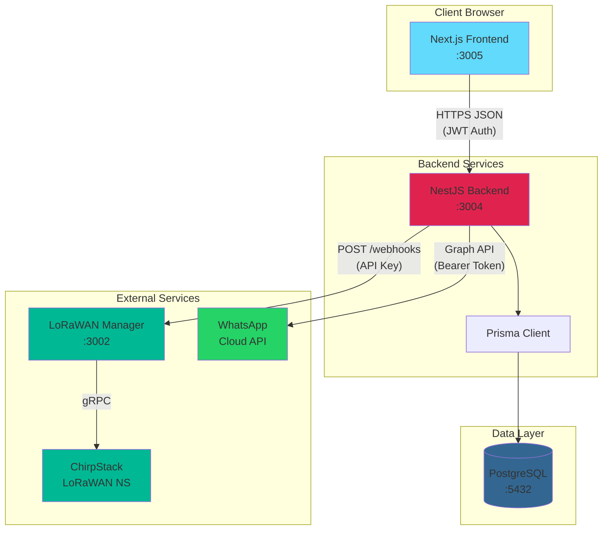

### Service Responsibilities

| Service | Port | Purpose |
|---------|------|---------|
| **Next.js Frontend** | 3005 | React UI, role-based dashboards, form handling |
| **NestJS Backend** | 3004 | REST API, business logic, auth, integrations |
| **PostgreSQL** | 5432 | Primary data store (via Prisma ORM) |
| **LoRaWAN Manager** | 3002 | Device provisioning orchestration |
| **ChirpStack** | - | LoRaWAN Network Server (external) |
| **WhatsApp Cloud API** | - | Customer notifications |

---

## 2. Authentication Flow

Sequence diagram showing the complete login flow from user action to authenticated session.

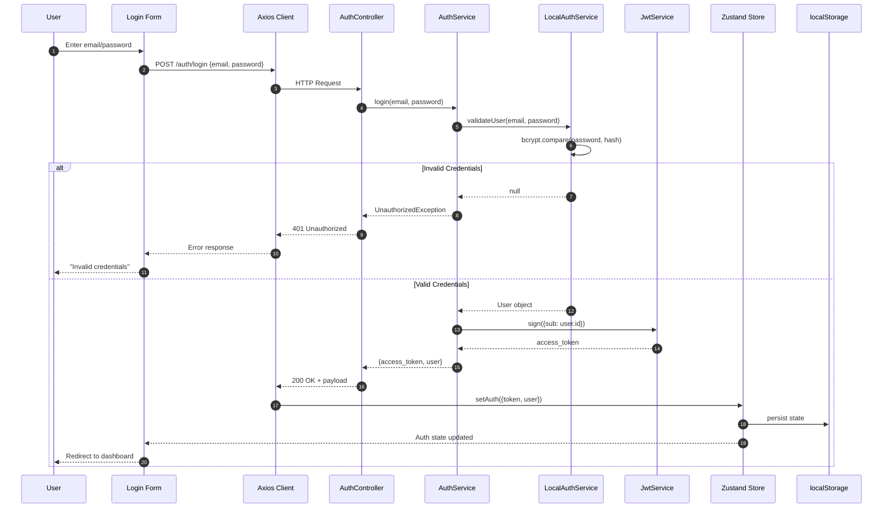

### Token Structure

```typescript
// JWT Payload
{
  sub: string;     // user.id
  iat: number;     // issued at
  exp: number;     // expiration (1h default)
}

// Auth Response
{
  access_token: string;
  user: {
    id: string;
    email: string;
    fullName: string;
    role: {
      id: string;
      name: "ADMIN" | "SALES" | "IMPLEMENTATION_LEAD" | "HARDWARE_ENGINEER";
      permissions: Record<string, boolean>;
    }
  }
}
```

---

## 3. Frontend Data Flow

Flowchart showing how data flows through the React application.

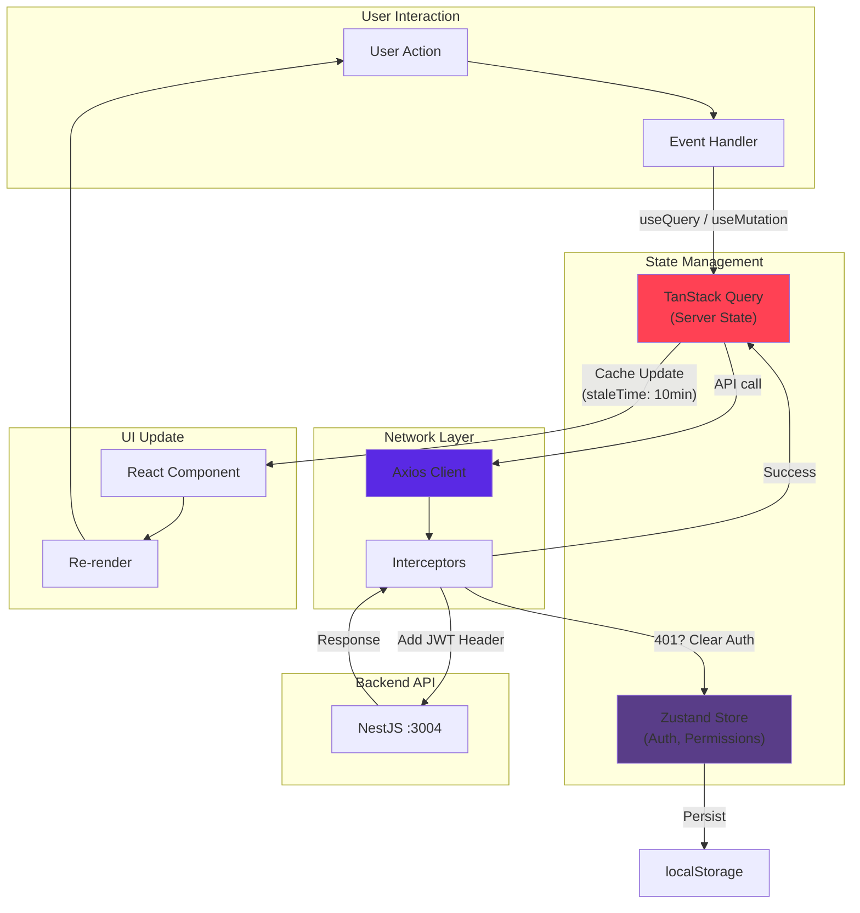

### Axios Interceptor Flow

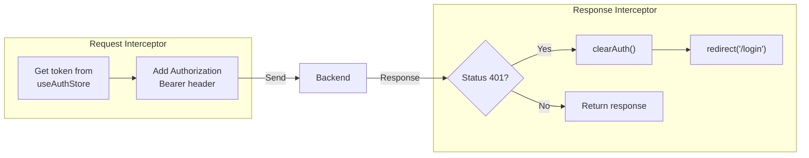

---

## 4. Backend Request Pipeline

Flowchart showing how requests flow through NestJS guards and handlers.

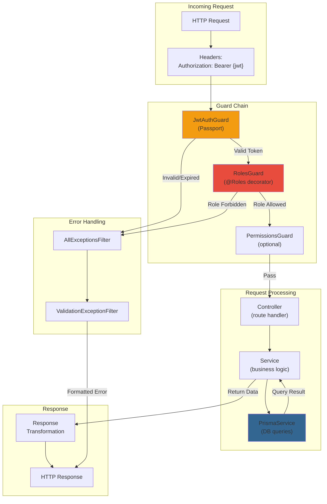

### Guard Execution Order

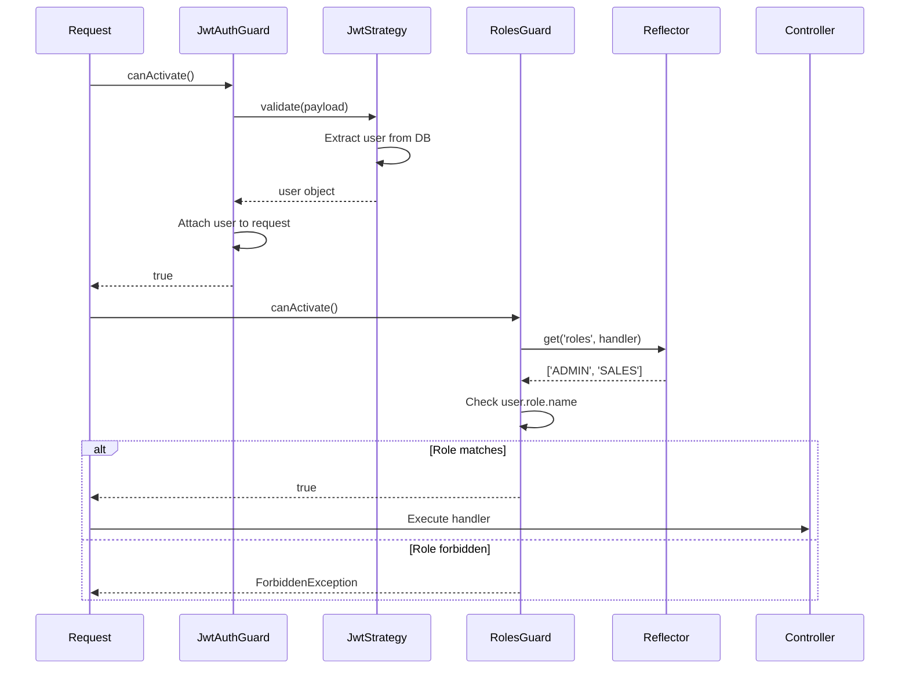

---

## 5. Workflow State Machine

State diagram showing the OnboardingTask lifecycle with role-based transition guards.

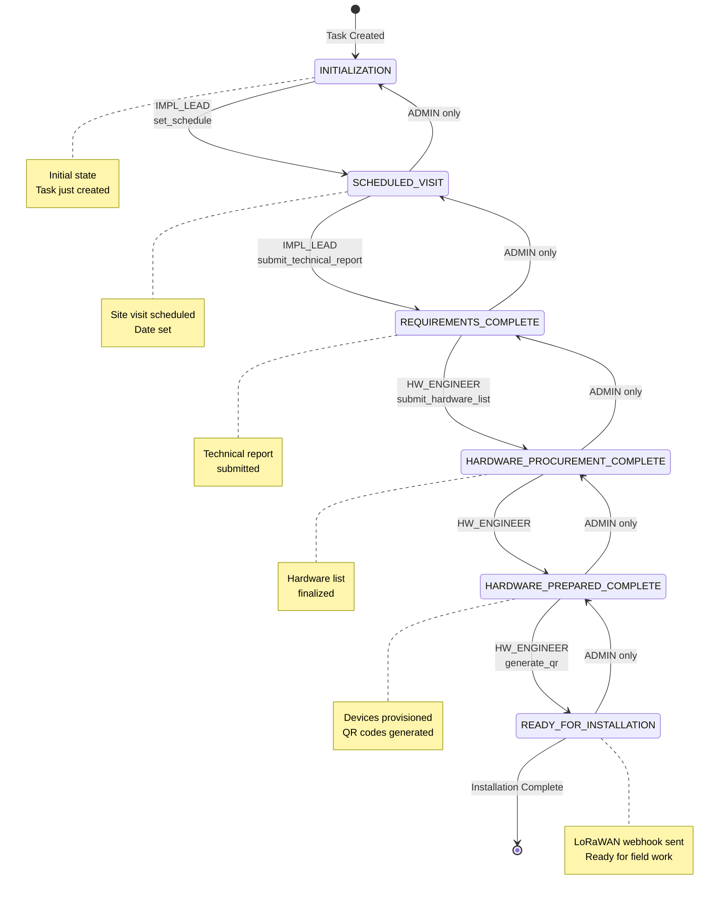

### Transition Rules

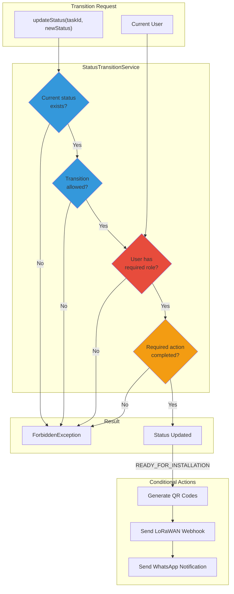

---

## 6. LoRaWAN Integration Flow

Sequence diagram showing the device provisioning webhook flow.

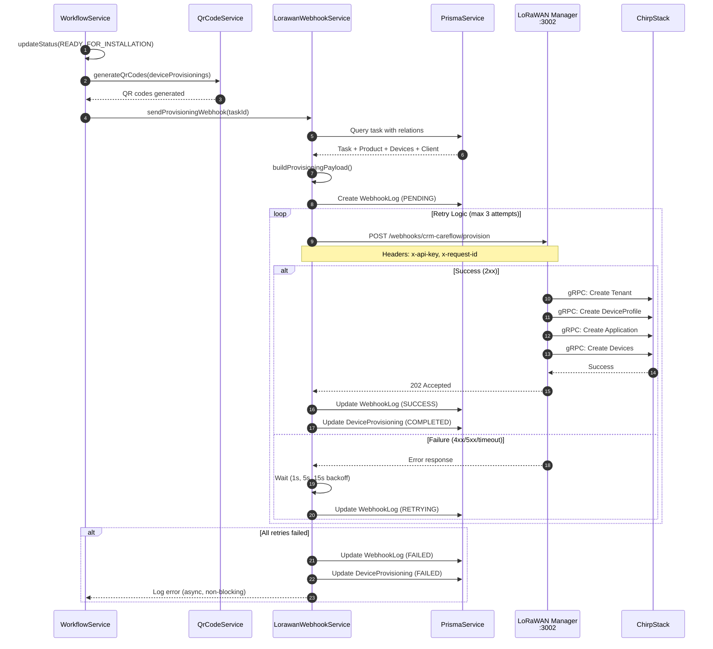

### Webhook Payload Structure

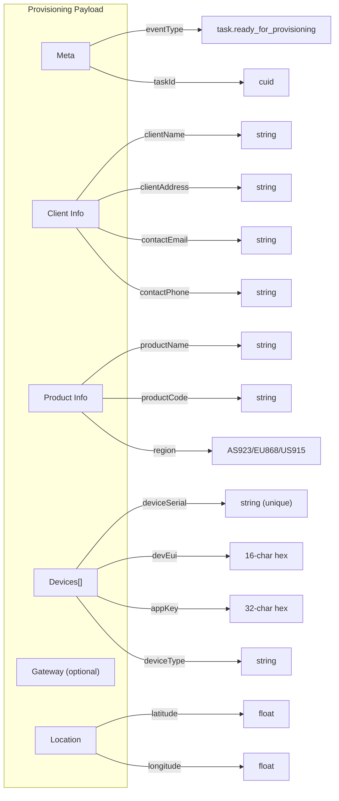

---

## 7. Device Provisioning Lifecycle

Flowchart showing the complete device provisioning process from hardware selection to ChirpStack registration.

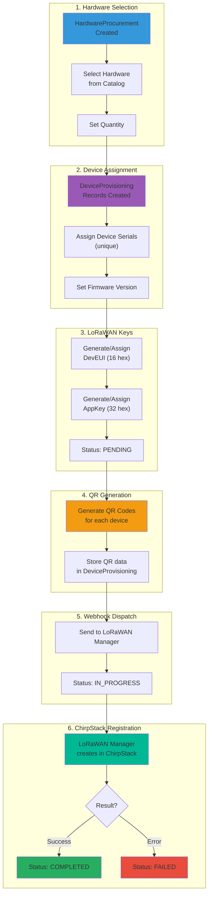

### Device States

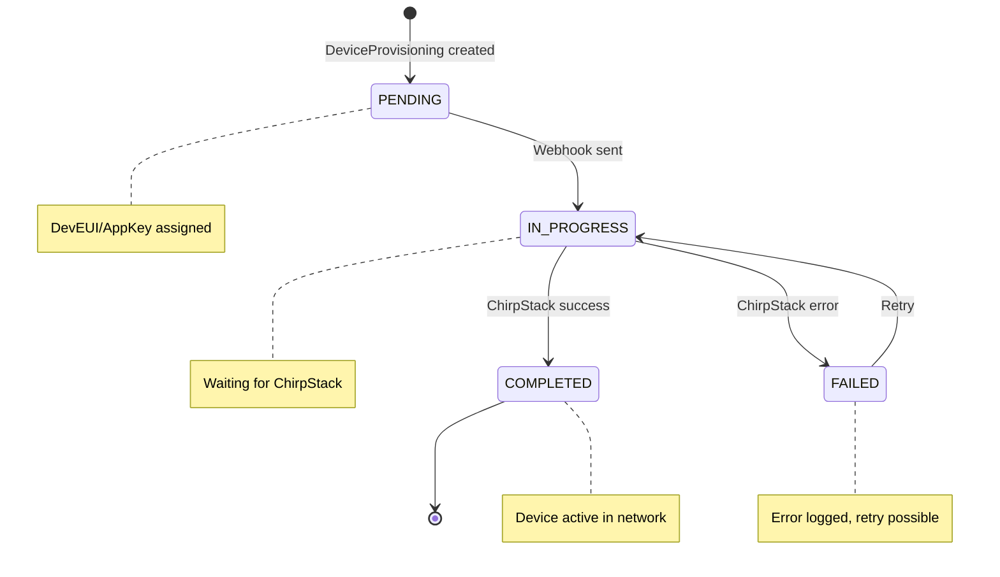

---

## 8. Database Entity Relationships

ER diagram showing the key database models and their relationships.

```mermaid
erDiagram
    User ||--o{ OnboardingTask : "assignedTo"
    User ||--o{ TechnicalReport : "submittedBy"
    User ||--o{ DeviceProvisioning : "provisionedBy"
    User }o--|| Role : "hasRole"

    Role {
        string id PK
        string name UK "ADMIN|SALES|IMPL_LEAD|HW_ENGINEER"
        json permissions
    }

    User {
        string id PK
        string email UK
        string passwordHash
        string fullName
        string roleId FK
        boolean isActive
    }

    Client ||--o{ OnboardingTask : "has"
    Client {
        string id PK
        string name UK
        string address
        string notes
        boolean isActive
    }

    Product ||--o{ OnboardingTask : "for"
    Product ||--o| SOPTemplate : "has"
    Product ||--o| ReportSchema : "has"
    Product ||--o{ ProductHardwareConfig : "configures"
    Product {
        string id PK
        string name
        string code UK
        string description
        boolean isActive
        boolean isLorawanProduct
        string lorawanRegion
    }

    OnboardingTask ||--o{ DeviceProvisioning : "provisions"
    OnboardingTask ||--o{ HardwareProcurement : "requires"
    OnboardingTask ||--o{ TechnicalReport : "generates"
    OnboardingTask ||--o{ WebhookLog : "logs"
    OnboardingTask {
        string id PK
        string clientId FK
        string productId FK
        string assignedUserId FK
        enum currentStatus "TaskStatus"
        json sopSnapshot
        datetime scheduledDate
        float latitude
        float longitude
        string clientName
        string clientEmail
        string clientPhone
        string clientAddress
        string contactPerson
    }

    HardwareCategory ||--o{ Hardware : "contains"
    HardwareCategory {
        string id PK
        string name UK
        string description
        string icon
        boolean isActive
    }

    Hardware ||--o{ ProductHardwareConfig : "usedIn"
    Hardware ||--o{ HardwareProcurement : "procured"
    Hardware ||--o{ DeviceProvisioning : "provisioned"
    Hardware {
        string id PK
        string name
        string code UK
        string description
        string categoryId FK
        string manufacturer
        boolean isActive
    }

    ProductHardwareConfig {
        string productId FK
        string hardwareId FK
        string firmwareVersion
        string firmwareUrl
        boolean isDefault
        string notes
    }

    HardwareProcurement {
        string id PK
        string taskId FK
        string hardwareId FK
        int quantity
        string notes
    }

    DeviceProvisioning {
        string id PK
        string taskId FK
        string hardwareId FK
        string deviceSerial UK
        string deviceType
        string firmwareVersion
        string qrCode
        string provisionedById FK
        string devEui
        string appKey
        enum lorawanProvisioningStatus
        string lorawanProvisioningError
        datetime provisionedAt
    }

    TechnicalReport {
        string id PK
        string taskId FK
        string submittedById FK
        json submissionData
        datetime submittedAt
    }

    SOPTemplate {
        string id PK
        string productId FK UK
        json steps
        int version
    }

    ReportSchema {
        string id PK
        string productId FK UK
        json formStructure
        int version
    }

    WebhookLog {
        string id PK
        string taskId FK
        string webhookType
        string endpoint
        json payload
        enum status "PENDING|SUCCESS|FAILED|RETRYING"
        int statusCode
        json response
        string errorMessage
        int attempts
        datetime lastAttempt
    }
```

---

## 9. Notification Flow

Flowchart showing the WhatsApp notification triggers and flow.

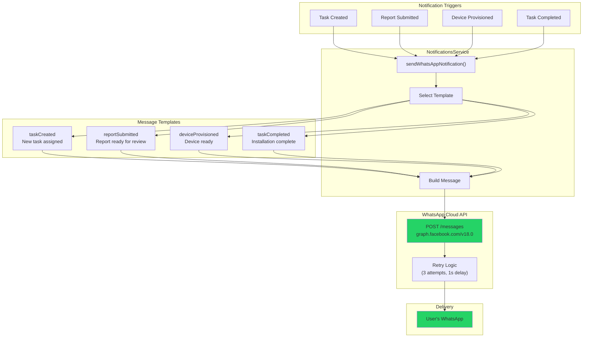

---

## 10. Complete Request Flow Example

End-to-end example: Creating a new task and progressing to installation-ready.

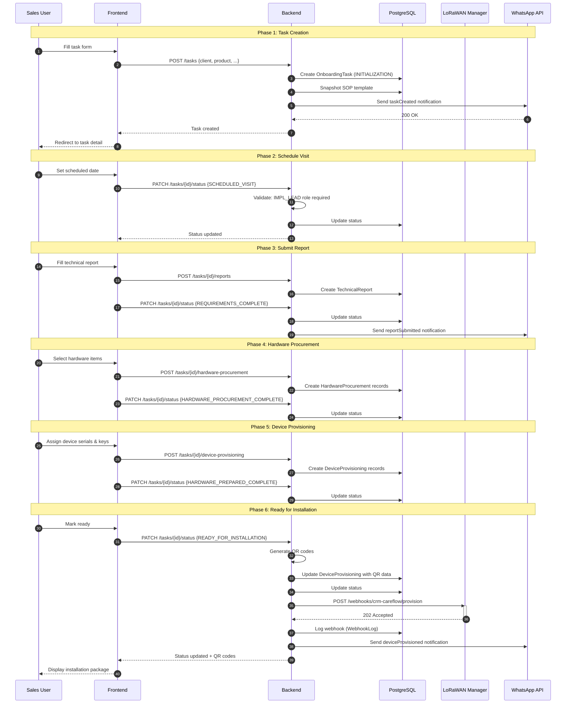

---

## Appendix: Key File References

### Backend

| Component | File Path |
|-----------|-----------|
| Auth Module | `backend/src/auth/` |
| JWT Strategy | `backend/src/auth/jwt.strategy.ts` |
| Roles Guard | `backend/src/auth/guards/roles.guard.ts` |
| Workflow Service | `backend/src/workflow/workflow.service.ts` |
| Status Transitions | `backend/src/workflow/status-transition.service.ts` |
| LoRaWAN Webhook | `backend/src/integrations/lorawan/lorawan-webhook.service.ts` |
| Notifications | `backend/src/notifications/notifications.service.ts` |
| Prisma Schema | `backend/prisma/schema.prisma` |

### Frontend

| Component | File Path |
|-----------|-----------|
| Auth Store | `frontend/lib/zustand-store/store.ts` |
| API Client | `frontend/services/api.ts` |
| Auth Hooks | `frontend/hooks/useAuth.ts` |
| TanStack Setup | `frontend/TanStackQuery.Providers.tsx` |
| Login Page | `frontend/app/login/page.tsx` |

---

*Last updated: January 2025*
